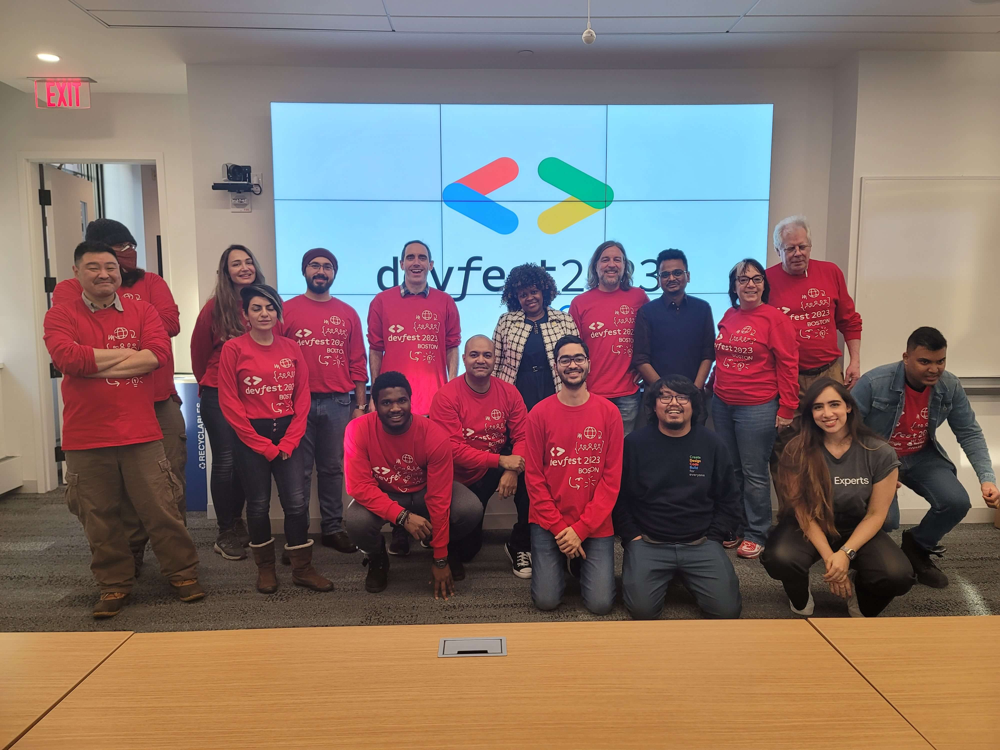

# Talks

About Harsh Kapadia: [harshkapadia.me](https://harshkapadia.me)

Feel free to [reach out](https://links.harshkapadia.me) for talks, interviews, panels, hosting, etc.!

## Previous Talks

-   [Executable and Linkable Format (ELF) Files on Linux](elf)
-   [MAC and IP Routing](mac-and-ip-routing)
-   [Git Internals - How Does Git Work!?](git_internals)
-   [Git Basics - The Basics of Git and GitHub!](git_basics)
-   [Hacktoberfest 2020, Open Source, Branches and Pull Requests.](otc_open_source_hacktoberfest_2020)

## Planned Talks

-   [Working with CORS](cors)
-   [Team Attitude for Organising a Hackathon](hackathon-team-attitude)

## Interviews

-   [Dive Into Communities - My views on Tech communities and related topics](https://www.youtube.com/watch?v=RBJAE2W5JVA) (Nov 13, 2022)
-   [Noobcast - My Thoughts on Web Development, OTC, GCE, Internships, etc.](https://www.youtube.com/watch?v=its-ftqt0UI) (May 15, 2022)
-   [How to Become a GitHub Campus Expert (GCE).](https://www.youtube.com/watch?v=iVhRtgyCZhc) (Jan 7, 2022)

## Panels

-   In-person [Community Ask Me Anything (AMA)](https://youtu.be/BfhBa9sOxw4?t=15434) panelist and volunteer at [GDG DevFest Boston 2023](https://gdg.community.dev/events/details/google-gdg-cloud-boston-presents-devfest-boston-2023) (Jan 28, 2023)

    

## Hosting

-   Weekly [OTC CatchUp](https://catchup.ourtech.community) sessions (Oct 2020 - present)
-   [Chirag Nayyar on Getting Started with Cloud](https://www.youtube.com/watch?v=TRjOhBSZKY0) ([Summary](https://blog.harshkapadia.me/2020/chirag-nayyar)) (Aug 22, 2020)
-   [TSEC Show and Tell - Showcasing Hackathon Projects!](https://www.youtube.com/watch?v=0dYJ3GJwcBo) (Jul 12, 2020)
-   [The Ali Mustufa Shaikh Interview](https://www.youtube.com/watch?v=RfkDB-zCmB8) ([Summary](https://blog.harshkapadia.me/2020/ali-mustufa-shaikh)) (Jul 8, 2020)
-   [The Jason Mayes Interview](https://www.youtube.com/watch?v=tbc-Rvfg2nE) ([Summary](https://blog.harshkapadia.me/2020/jason-mayes)) (Jul 1, 2020)
