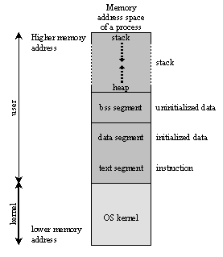

# Executable and Linkable Format

We're going to learn about ELF, the primary executable file format on Linux. We're going to explore its format and look into a few examples using an ELF parser that I built. We're also going to look into utilities to inspect binaries. To get started with ELFs, though, we need some high level knowledge on how programs are compiled and loaded into memory (RAM).

> NOTE:
>
> -   The 64-bit format of ELF is the focus of this talk. Most things remain the same for 32-bit ELFs.
> -   Discussions will be based around the C programming language.

## Compiling a Program

To execute a program, we usually do the following:

-   Write source code
-   Compile it
-   Execute it

    
	 
    
        Image credits: Harsh Kapadia (me)
    

The `a.out` file generated after compilation, as shown in the above image, is an ELF file.

In reality, there is a lot going on on the backend for each step in the above image.

To compile a program, i.e., to create an executable binary, the high level steps are:

-   Preprocessing
-   Compilation
-   Assembling
-   Linking

To load the program into memory, 'Loading' is the process that's undertaken by the Loader.

    
	 
    
        Image source: <a href="https://www.tenouk.com/ModuleW.html" target="_blank" rel="noreferrer">Compiler, Assembler, Linker and Loader: A Brief Story</a>
    

More information on each of the compilation steps and examples to illustrate each can be found at [github.com/HarshKapadia2/compilation-examples](https://github.com/HarshKapadia2/compilation-examples).

## Program Memory Layout

The Loader loads a program into memory in a specific manner to execute it.

    
	 
    
        Image source: <a href="https://www.tenouk.com/ModuleW.html" target="_blank" rel="noreferrer">Compiler, Assembler, Linker and Loader: A Brief Story</a>
    

At a high level, a process' memory layout consists of

-   Stack Segment
    -   Is a Stack data structure that maintains the function call order by pushing a stack frame per function call and popping a frame off once the function returns from the call.
    -   On a high level, each stack frame consists of
        -   The callee function's local variables
        -   The callee function's input parameters
        -   The address for where to return in the caller function
        -   Some bookkeeping information
    -   The Stack grows downwards towards the Heap in the process' address space with each frame's addition.
    -   The top of a Stack is pointed to by the Stack Pointer (SP).
    -   Depending on the OS, there might be a configuration parameter to decide the maximum size of the Stack.
-   Heap Segment
    -   This is a Heap data structure used to allocate memory during run time, i.e., dynamically or on-the-fly.
    -   This is where variables get memory allocated to them when they request for it through `malloc()`, `calloc()` and the likes.
    -   The Heap grows upwards towards the Stack as more memory is allocated.
    -   It can be a source for memory leaks if the memory is not freed properly or is accessed randomly.
-   BSS Segment (uninitialized variables)
    -   The 'Block Started by Symbol' segment is a segment that is used for uninitialized variables, i.e., global and statically allocated variables that were not given any initial value in the original code.
    -   Variables in this **segment** are initialized to zero and occupy the space they requested during declaration, unlike when they were in the BSS **section**.
        -   [What happens when a variable in the BSS section is assigned a value? (Array example)](https://linux.harshkapadia.me/#memory-layout-and-compilers:~:text=What%20happens%20when%20a%20variable%20in%20the%20BSS%20section%20is%20assigned%20a%20value%3F)
        -   The difference between sections and segments will be discussed further on.
-   Data Segment (initialized variables)
    -   This segment stores variables that were initialized with non-zero values in the original code and they occupy the size they were declared with, i.e., statically allocated variables.
    -   This segment also stores non-zero initialized global variables.
-   Code Segment
    -   The Code (Text) segment is where the code of the program is stored, usually in machine code format.
    -   The Program Counter (PC) register, also called the Instruction Pointer (IP) register, points to the address of the next instruction to be executed.

A more complex view of a process' memory layout:

    
	 
    
        Image source: <a href="https://www.tenouk.com/ModuleW.html" target="_blank" rel="noreferrer">Compiler, Assembler, Linker and Loader: A Brief Story</a>
    

The change here mainly pertains to the mapping of shared libraries in the process' address space between the Stack and Heap. This is usually happens when some libraries are dynamically linked to a program. (Statically linked libraries usually appear in the 'Code' segment of the process itself.)

**NOTE**: The process' entire memory space appears consecutive and contiguous in the above representation, because that is the virtual address space representation of the memory space of the process. In reality, i.e. in terms of physical location in memory, the mapping for each segment might be in different locations in memory. Virtual addressing only makes the entire process' memory space appear contiguous for various security and convenience reasons.

    
	 
    
        Image source: <a href="https://www.tenouk.com/ModuleW.html" target="_blank" rel="noreferrer">Compiler, Assembler, Linker and Loader: A Brief Story</a>
    

