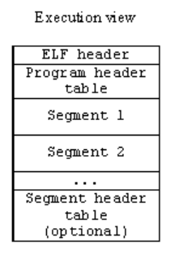

# Executable and Linkable Format

We're going to learn about ELF, the primary executable file format on Linux. We're going to explore its format and look into a few examples using an ELF parser that I built. We're also going to look into utilities to inspect binaries. To get started with ELFs, though, we need some high level knowledge on how programs are compiled and loaded into memory (RAM).

> NOTE:
>
> -   The 64-bit format of ELF is the focus of this talk. Most things remain the same for 32-bit ELFs.
> -   Discussions will be based around the C programming language.

## Compiling a Program

To execute a program, we usually do the following:

-   Write source code
-   Compile it
-   Execute it

<p align="center">
    
	<br />
    <sub>
        Image credits: Harsh Kapadia (me)
    </sub>
</p>

The `a.out` file generated after compilation, as shown in the above image, is an ELF file.

In reality, there is a lot going on on the backend for each step in the above image.

To compile a program, i.e., to create an executable binary, the high level steps are:

-   Preprocessing
-   Compilation
-   Assembling
-   Linking

To load the program into memory, 'Loading' is the process that's undertaken by the Loader.

<p align="center">
    
	<br />
    <sub>
        Image source: <a href="https://www.tenouk.com/ModuleW.html" target="_blank" rel="noreferrer">Compiler, Assembler, Linker and Loader: A Brief Story</a>
    </sub>
</p>

More information on each of the compilation steps and examples to illustrate each can be found at [github.com/HarshKapadia2/compilation-examples](https://github.com/HarshKapadia2/compilation-examples).

## Program Memory Layout

The Loader loads a program into memory in a specific manner to execute it.

<p align="center">
    
	<br />
    <sub>
        Image source: <a href="https://www.tenouk.com/ModuleW.html" target="_blank" rel="noreferrer">Compiler, Assembler, Linker and Loader: A Brief Story</a>
    </sub>
</p>

At a high level, a process' memory layout consists of

-   Stack Segment
    -   Is a Stack data structure that maintains the function call order by pushing a stack frame per function call and popping a frame off once the function returns from the call.
    -   On a high level, each stack frame consists of
        -   The callee function's local variables
        -   The callee function's input parameters
        -   The address for where to return in the caller function
        -   Some bookkeeping information
    -   The Stack grows downwards towards the Heap in the process' address space with each frame's addition.
    -   The top of a Stack is pointed to by the Stack Pointer (SP).
    -   Depending on the OS, there might be a configuration parameter to decide the maximum size of the Stack.
-   Heap Segment
    -   This is a Heap data structure used to allocate memory during run time, i.e., dynamically or on-the-fly.
    -   This is where variables get memory allocated to them when they request for it through `malloc()`, `calloc()` and the likes.
    -   The Heap grows upwards towards the Stack as more memory is allocated.
    -   It can be a source for memory leaks if the memory is not freed properly or is accessed randomly.
-   BSS Segment (uninitialized variables)
    -   The 'Block Started by Symbol' segment is a segment that is used for uninitialized variables, i.e., global and statically allocated variables that were not given any initial value in the original code.
    -   Variables in this **segment** are initialized to zero and occupy the space they requested during declaration, unlike when they were in the BSS **section**.
        -   [What happens when a variable in the BSS section is assigned a value? (Array example)](https://linux.harshkapadia.me/#memory-layout-and-compilers:~:text=What%20happens%20when%20a%20variable%20in%20the%20BSS%20section%20is%20assigned%20a%20value%3F)
        -   The difference between sections and segments will be discussed further on.
-   Data Segment (initialized variables)
    -   This segment stores variables that were initialized with non-zero values in the original code and they occupy the size they were declared with, i.e., statically allocated variables.
    -   This segment also stores non-zero initialized global variables.
-   Code Segment
    -   The Code (Text) segment is where the code of the program is stored, usually in machine code format.
    -   The Program Counter (PC) register, also called the Instruction Pointer (IP) register, points to the address of the next instruction to be executed.

A more complex view of a process' memory layout:

<p align="center">
    
	<br />
    <sub>
        Image source: <a href="https://www.tenouk.com/ModuleW.html" target="_blank" rel="noreferrer">Compiler, Assembler, Linker and Loader: A Brief Story</a>
    </sub>
</p>

The change here mainly pertains to the mapping of shared libraries in the process' address space between the Stack and Heap. This is usually happens when some libraries are dynamically linked to a program. (Statically linked libraries usually appear in the 'Code' segment of the process itself.)

**NOTE**: The process' entire memory space appears consecutive and contiguous in the above representation, because that is the virtual address space representation of the memory space of the process. In reality, i.e. in terms of physical location in memory, the mapping for each segment might be in different locations in memory. Virtual addressing only makes the entire process' memory space appear contiguous for various security and convenience reasons.

<p align="center">
    
	<br />
    <sub>
        Image source: <a href="https://www.tenouk.com/ModuleW.html" target="_blank" rel="noreferrer">Compiler, Assembler, Linker and Loader: A Brief Story</a>
    </sub>
</p>

## The Executable and Linkable Format

The Executable and Linkable Format (ELF) is a format which standardizes and defines the structure in which each type of data in a file should be stored and also defines how the metadata associated with the file should be stored in the file.

The ELF was adopted from UNIX System V and has remained unchanged since the early 2000s, which is impressive!

The Executable and Linkable Format is not just a file format for executables. Some file types that use the ELF:

-   Executable files (binaries)
-   Object files (relocatable files) (`*.o`)
-   Shared Object files (`*.so.*`)
-   Core dump files

Note how the output of the `file` command on an executable file outputs that the file is an 'ELF' file:

```shell
$ file a.out           # 'a.out' is the default executable file generated on compiling a C program using GCC
a.out: ELF 64-bit LSB pie executable, x86-64, version 1 (SYSV), dynamically linked, interpreter /lib64/ld-linux-x86-64.so.2, BuildID[sha1]=d3f6d6241d69c2e0de9d136fb09190d9175f5171, for GNU/Linux 3.2.0, not stripped
```

There are two formats of the Executable and Linkable Format:

-   The 32-bit format for CPUs that support 32-bit addressing
-   The 64-bit format for CPUs that support 64-bit addressing

Most modern machines are 64-bit machines, so this article will mainly look into the 64-bit format. Most things remain the same for the 32-bit format.

## ELF File Structure

<p align="center">
    
	<br />
    <sub>
        Image source: <a href="https://subscription.packtpub.com/book/security/9781789610789/14/ch14lvl1sec00/elf-structure" target="_blank" rel="noreferrer">ELF structure</a>
    </sub>
</p>

The main parts of an ELF file:

-   File (ELF) Header
    -   Identifies through 'magic bytes' that the file is an ELF file.
    -   Identifies which version and type of an ELF file the file is.
    -   Identifies which machine architecture the file is meant for.
    -   Provides offsets to the location of section and segment header tables in the file.
-   Section Headers
    -   Contain metadata about sections.
    -   Identify the type and permissions of sections.
    -   Provide an offset to the location of a section's data in the file.
-   Segment (Program) Headers
    -   Contain metadata about segments.
    -   Identify the type and permissions of segments.
    -   Provide an offset to the location of a segment's data in the file.
-   Sections
    -   Areas that contain data for specific purposes.
    -   Mainly used by the Linker for Linking and Relocation.
-   Segments
    -   Areas that contain data for specific purposes that has to be loaded into specific areas in the process' address space in memory.
    -   Mainly used by the Loader to load the program into the memory.
    -   Each segment can have zero, one or more sections. Similar sections are usually clubbed into a segment.

## Views of an ELF File

ELF is an abbreviation for Executable and Linkable Format, which implies that the format it describes has something to do with Execution and Linking.

**The same ELF file** can be looked at in two different ways, depending on the file handler (Linker or Loader):

-   Linking View
-   Execution View

NOTE: It is important to realise that the same file is being looked at in two different representations. There aren't different files. It's the same file. The same file is just represented differently.

<p align="center">
    
	<br />
    <sub>
        Image source: <a href="https://www.tenouk.com/ModuleW.html" target="_blank" rel="noreferrer">Compiler, Assembler, Linker and Loader: A Brief Story</a>
    </sub>
</p>

### Linking View of an ELF File

<p align="center">
    
	<br />
    <sub>
        Image source: <a href="https://www.tenouk.com/ModuleW.html" target="_blank" rel="noreferrer">Compiler, Assembler, Linker and Loader: A Brief Story</a>
    </sub>
</p>

-   This is the view of the ELF file that a Linker sees.
-   The Linking View mainly consists of
    -   The ELF (File) Header
        -   Among other details, the File Header mainly provides the following for this view
            -   The file offset to the Section Header Table
            -   The number of Section Headers
            -   The size of each Section Header
            -   The index of the 'Section Name String Table' Section Header in the Section Header Table
    -   The Section Header Table
        -   This is an area of the file which contains Section Headers.
    -   Section Headers
        -   These are fixed sized entries (`structs` in C) that contain metadata about Sections in the file, where the actual data is stored.
        -   Among other details, a Section Header mainly provides the following information about a Section
            -   Name
                -   The header only stores a section offset, i.e. an offset inside the data in a section. The name of the section that stores the names of the sections is 'Section Name String Table'.
                    -   This is done so that each Section Header can have a fixed size. (Strings can be arbitrarily long.)
            -   Type
            -   Permission flags
            -   File offset
            -   Size
    -   Sections
        -   A section is an area of the file that contains logically similar data with a particular purpose.
        -   Some important sections and their usage
            -   `.text`
                -   The program's code (in Machine Code format) is stored here.
            -   `.data`
                -   Initialized statically allocated variables are stored here.
                -   These variables occupy the statically requested memory in the file.
            -   `.bss`
                -   Uninitialized statically allocated variables are stored here.
                -   These variables occupy no space in the file other than the space required to describe the variable itself, i.e., the variable's metadata.
            -   `.rodata`
                -   Read-only data like string literals are stored here.
            -   `.shstrtab`
                -   This is the 'Section Header String Table' section that holds the strings of names of all the sections.
                -   The `elf64_shdr->name` structure member holds relative offsets into the data in this section.
            -   `.dynstr`
                -   This is similar to the 'Section Header String Table', but it stores strings of the names of dynamic libraries mentioned in the `.dynamic` section.
            -   `.dynamic`
                -   This section holds Dynamic Entries
                -   Among other things, some of these entries point to names of dynamic libraries that the executable depends on.
            -   Apart from these, some of the important sections are for symbols and relocation entries.
            -   `.got`
                -   The Global Offset Table
-   This view is required so that the Linker can access the correct symbols (functions, global variables, etc.) in multiple Object Files that it has to resolve from different header files and libraries, and eventually relocate all the data from different libraries and files into a particular order to create one executable.

### Execution View of an ELF File

<p align="center">
    
	<br />
    <sub>
        Image source: <a href="https://www.tenouk.com/ModuleW.html" target="_blank" rel="noreferrer">Compiler, Assembler, Linker and Loader: A Brief Story</a>
    </sub>
</p>

-   This view is mainly useful for the Loader when it is supposed to load a program into its process address space in memory.
    -   The same file is just represented in a different way than [the Linking View](#linking-view-of-an-elf-file).
-   Please refer to [the 'Process Memory Layout' section](#process-memory-layout) above to know about how a process is structured in memory.
-   The Execution View mainly consists of
    -   The ELF (File) Header
        -   Among other details, the File Header mainly provides the following for this view
            -   The file offset to the Segment Header Table
            -   The number of Segment Headers
            -   The size of each Segment Header
    -   The Segment Header Table
        -   This is an area of the file which contains Segment Headers.
    -   Segment Headers
        -   These are fixed sized entries (`structs` in C) that contain metadata about Segments in the file, where the actual data is stored.
        -   Among other details, a Segment Header mainly provides the following information about a Segment
            -   Type
            -   Permission flags
                -   They decide whether the segment needs to be loaded into memory or not.
            -   File offset
            -   Size
    -   Segments
        -   A segment is a collection of related sections.
        -   Some important segments and their usage
            -   The Code (Text) Segment
                -   Used to store the `.text` and the `.rodata` sections.
            -   The Data Segment
                -   Used to store the `.data` and the `.bss` sections.
