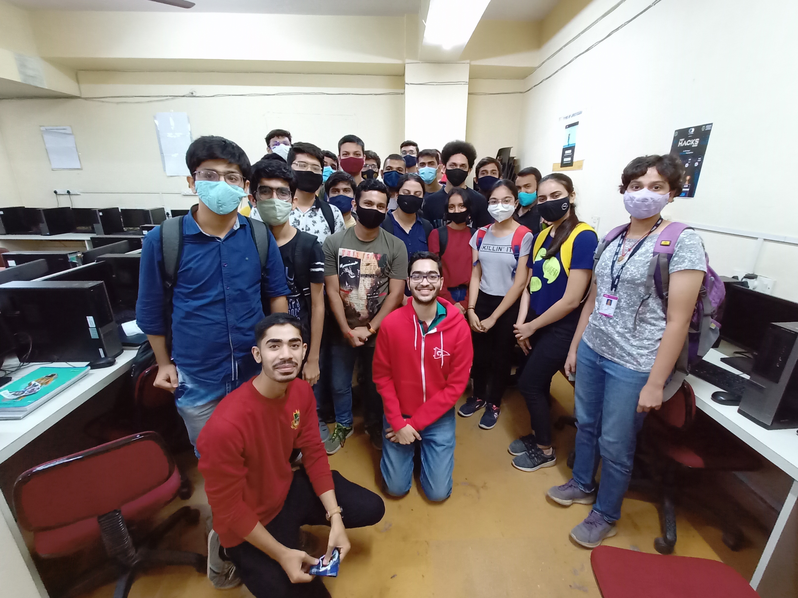
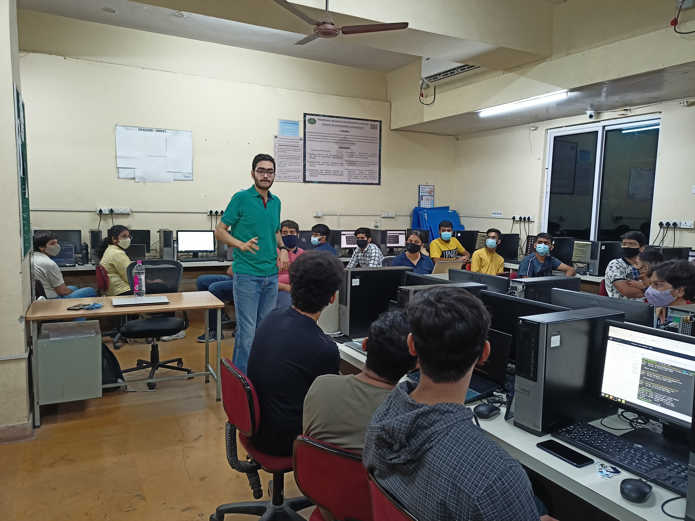
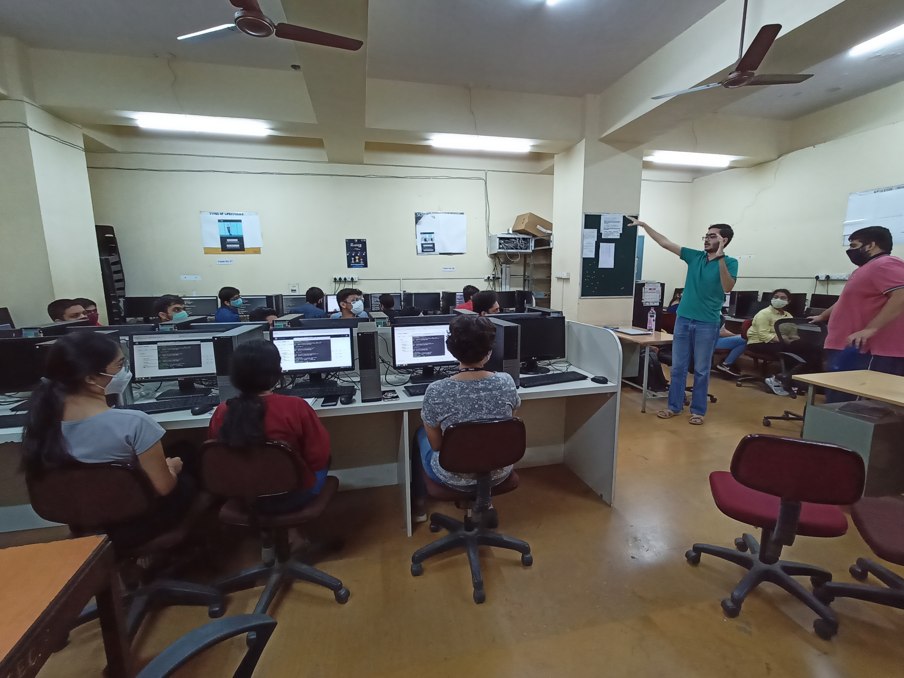
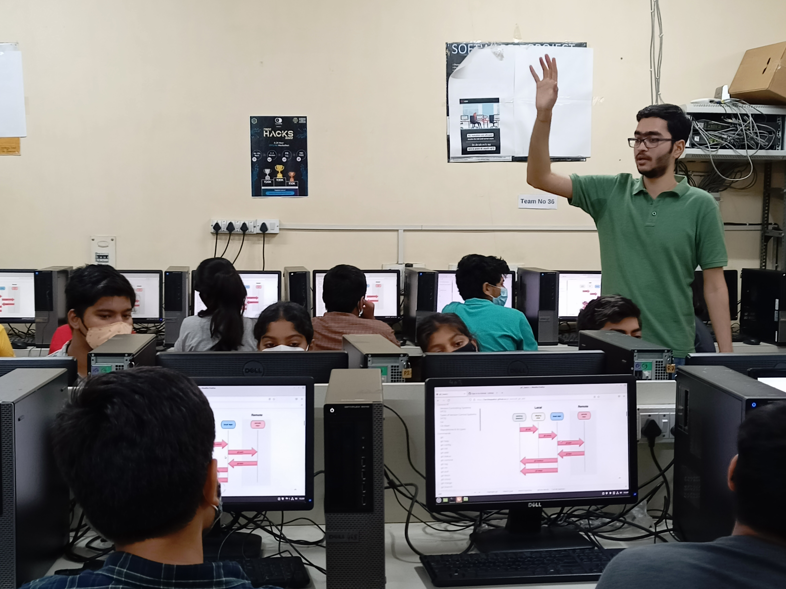
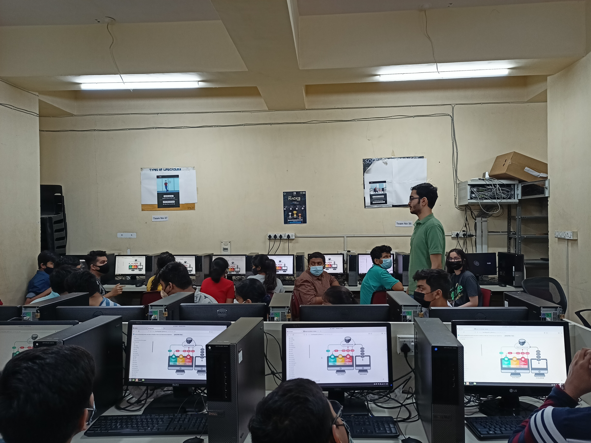

# Git Basics

-   Two hour session.
-   Covers most of the basics of Git and GitHub.
-   Whether one is a student, an Open Source contributor, a Tech professional or at a Tech managerial position, Git and GitHub is something that will be required in some capacity. Thus, understanding the basic concepts and jargon of Git are helpful, no matter which field of Tech one is a part of. This talk/workshop will help one understand the most commonly used Git commands like `git commit`, `git add`, `git pull`, `git push`, `git log`, `git status`, `git branch` and more.
-   [Talk content](content.md)
-   git_basics
    -   [Repo](https://github.com/HarshKapadia2/git_basics)
    -   [PWA](https://harshkapadia2.github.io/git_basics)
    -   [Play Store (TWA)](https://play.google.com/store/apps/details?id=com.harsh_kapadia.git_basics)
-   Previous **online** talks on this
    -   [The basics of Branching, Issues and Pull Requests for MLH Fellowship](https://youtu.be/LfgDc7BbhaY?t=946) (June 5, 2023)
    -   [Git Basics for GDSC TSEC](https://www.youtube.com/watch?v=OmZHKCg7qf4) (Oct 8, 2021)
    -   [Git and GitHub Workshop for TSEC MAD Club](https://www.youtube.com/watch?v=J8-VT6_HB08) (June 27, 2021)
    -   [Git and GitHub Workshop for TSEC CodeCell](https://www.youtube.com/watch?v=ArOKEf8nkfw) (March 21, 2021)
    -   [Git and GitHub crash course + workshop for ACES MITADT](https://www.youtube.com/watch?v=5rlHIOqPKWk) (February 24 & 28, 2021)
    -   Git and GitHub crash course for GirlScript Pathankot (February 21, 2021)
    -   [Git and GitHub crash course for Progate](https://www.youtube.com/watch?v=X8AoLwKQ13A&list=WL&index=226) (January 27, 2021)
    -   [The original git_basics Git and GitHub crash course](https://www.youtube.com/watch?v=HF12-91iazM) (June 28, 2020)
    -   Git and GitHub crash course for ML Academy (June 22, 2020)
-   Previous **offline** workshops on this

    -   Git Basics for [TSEC CodeCell](https://www.tseccodecell.com) (March 22, 2022)

        

    -   Git Basics for [TSEC CodeCell](https://www.tseccodecell.com) (March 21, 2022)

        
