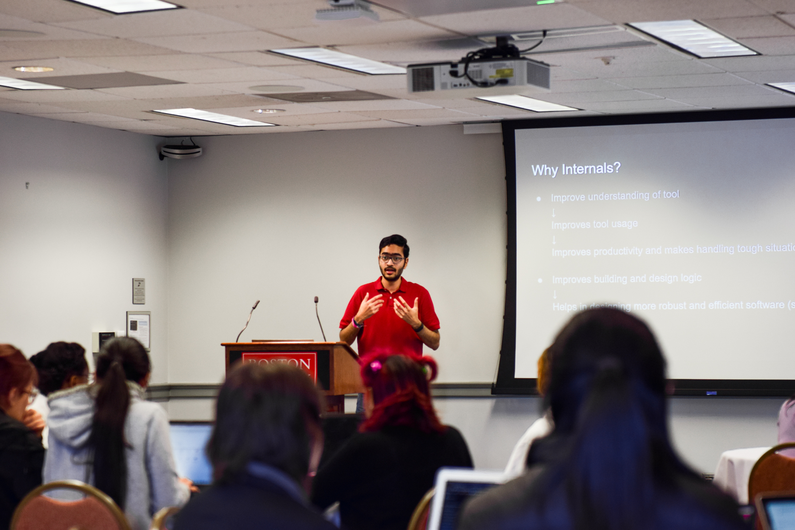
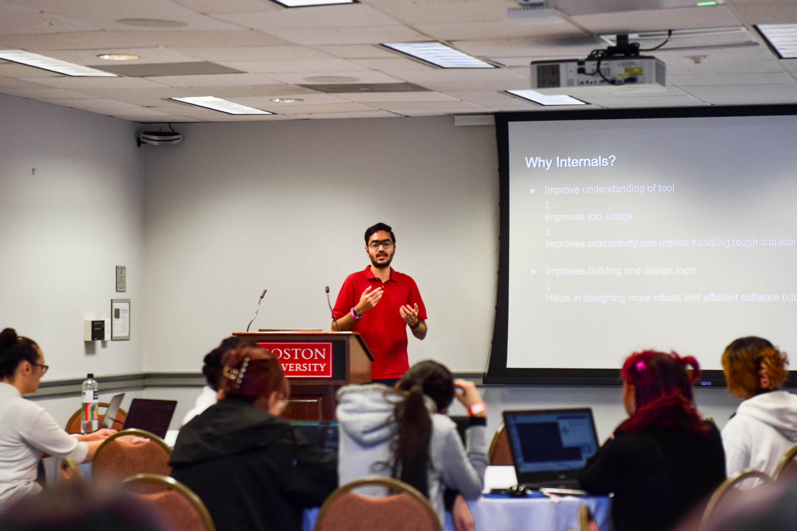

# Git Internals

-   General duration: 2 - 2.5 hrs
-   The Short Version: 1 - 1.5 hour
-   Covers the internals of Git, mainly explaining the need of specific directories and files in the `.git` directory and showcasing the Directed Acyclic Graph that Git creates to connect Commit, Tree and Blob objects internally.
    -   Packfiles are also touched upon.
-   Why do millions of people use Git to version their code? It's because of its features, convenience, structure and design! This talk explores what we can learn from the structure and design of Git to write better software and use these principles in practice to efficiently manage, store, transfer and query data. We will broadly talk about Packfiles and efficiently handling CRUD operations on files.
-   Content
    -   [Agenda](agenda.md)
    -   [Git Internals](https://git.harshkapadia.me)
    -   [Git Graph](https://git-graph.harshkapadia.me)
    -   [Slide Deck](https://docs.google.com/presentation/d/1Ri9HMkvFRVg_ICHQBpLHEoQIcm6ybs75-nJH7fZQYNs/edit?usp=sharing)
-   Previous **offline (in-person)** talks on this

    -   [BostonHacks 2022](https://bostonhacks.io) at [Boston University](https://bu.edu) (Nov 12, 2022)
    -   [TechTogether Boston 2022](https://techtogether.io/techtogetherboston) at [Boston University](https://bu.edu) (Oct 29, 2022)

        

-   Previous **online** talks on this
    -   [Internals of Git for Sudhanshu Yadav's 'The Internals' meetup](https://github.com/The-Internals/Internals-of-git) (Jan 22, 2022)
    -   [Git Internals - How Does Git Work!?](https://www.youtube.com/watch?v=TZRS9llBBYU) (Oct 9, 2021)
