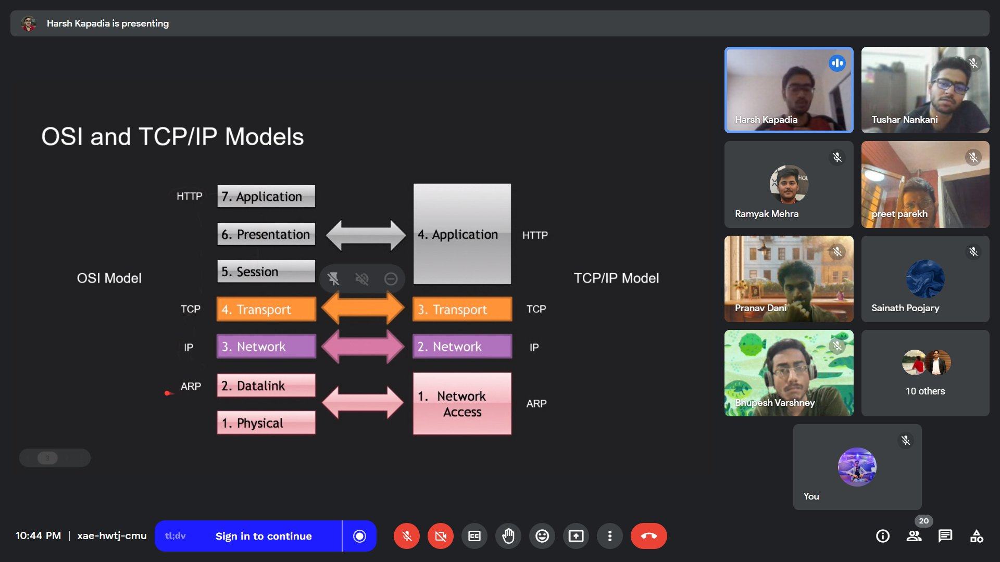

# MAC and IP Routing

-   Talk duration: ~1 hr
-   Abstract
    -   It is not intuitive to understand why MAC addresses are required for routing when IP addresses exist and how both MAC addresses and IP addresses work together to get packets/frames to their final destinations. This talk aims to demystify this.
-   [Talk content and explanation](content.md)
-   [Slide deck](https://docs.google.com/presentation/d/1DLoSxfzwURuZvKNoeyKGQUurs_qhCmETu-E0EOzt6xM/edit?usp=sharing)
-   Demo: [github.com/HarshKapadia2/mac-ip-routing](https://github.com/HarshKapadia2/mac-ip-routing)
-   Previous online talks on this

    -   'Routing using IP and MAC Addresses' at [OTC Talks #3](https://talks.ourtech.community/3) (March 25, 2023)

		
		 
		<a href="https://twitter.com/Ajaymaurya_1008/status/1640016994773917696" target="_blank" rel="noreferrer">Image source</a>
