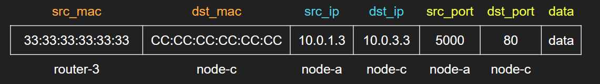

# 'MAC and IP Routing' Talk Content

## Table of Contents

-   [Introduction](#introduction)
-   [OSI Layers](#osi-layers)
-   [Internet Topology](#internet-topology)
-   [IP Addresses vs MAC Addresses](#ip-addresses-vs-mac-addresses)
-   [IP Routing](#ip-routing)
-   [MAC Address Requirement](#mac-address-requirement)
-   [MAC Routing](#mac-routing)
-   [Simplified Typical Frame Structure](#simplified-typical-frame-structure)
-   [Routing Example](#routing-example)
    -   [Network Topology](#network-topology)
    -   [IP Configuration](#ip-configuration)
    -   [At `node-a`](#at-node-a)
    -   [At `router-1`](#at-router-1)
    -   [At `router-3`](#at-router-3)
    -   [At `node-c`](#at-node-c)
    -   [Response from `node-c` to `node-a`](#response-from-node-c-to-node-a)
-   [Demonstration](#demonstration)
-   [Distributing IP Routing Information](#distributing-ip-routing-information)
-   [Resources](#resources)

## Introduction

It is not intuitive to understand why MAC addresses are required for routing when IP addresses exist and how both MAC addresses and IP addresses work together to get packets/frames to their final destinations. This piece attempts to demystify this.

> [Slide deck](https://docs.google.com/presentation/d/1DLoSxfzwURuZvKNoeyKGQUurs_qhCmETu-E0EOzt6xM/edit?usp=sharing)

## OSI Layers

<p align="center">
    
</p>

-   [OSI Layers](https://networking.harshkapadia.me/osi-layers): ARP is usually considered as a part of the Data Link Layer, but sometimes also a part of the Network Layer.

## Internet Topology

<p align="center">
    
    <br />
    <sub>
        <a href="http://www.tcpipguide.com/free/t_BGPTopologySpeakersBorderRoutersandNeighborRelatio-2.htm" target="_blank" rel="noreferrer">Image credits</a>
    </sub>
</p>

## IP Addresses vs MAC Addresses

-   IP address: Internet Protocol Address
    -   Address size
        -   IPv4: 32 bit
        -   IPv6: 128 bit
    -   Operation layer: Network Layer (OSI & TCP/IP models)
    -   Discovered using: Domain Name System (DNS)
-   MAC address: Media Access Control Address
    -   Address size: 48 bit
    -   Operation layer: Data Link Layer (OSI model) or Network Access Layer (TCP/IP model)
    -   Discovered using: Address Resolution Protocol (ARP)

## IP Routing

-   To reach a destination host, we need their [IP address](https://networking.harshkapadia.me/ip) to be able to route to them globally.
-   The [Domain Name System (DNS)](https://networking.harshkapadia.me/dns) helps get us the IP address.
-   IP addresses were designed with scalability in mind.
    -   IP addresses are organised hierarchically and can thus be segregated and located fast and easily.
    -   IP addresses are also organised in a manner where generalising a block of IP addresses is straightforward and helps save space in routing tables in routers, as they don't have to maintain each and every IP address individually.
        -   Eg: Instead of maintaining every IP individually like `10.0.0.0`, `10.0.0.1`, `10.0.0.2`, ..., `10.0.0.255`, routers can just express the entire range in a single line like `10.0.0.0/24` in their routing tables. ([CIDR notation](https://networking.harshkapadia.me/ip))
-   **Source and destination IP addresses never change during all the hops along the path between the source and destination hosts, as the destination needs to know who sent the payload to be able to reply to them.**

## MAC Address Requirement

If IP addresses can help identify and route to a host on the internet, then why are MAC addresses required?

-   The answer lies in the way the internet started.
-   When the internet started, there were small pockets of networks where MAC addresses were used for routing (finding a machine in a local subnet, which was what the internet was in its early days - pockets of isolated networks with few machines).
-   As the internet started growing, people realised that MAC routing was not scalable as each address was assigned on manufacturing, which means that devices could be anywhere and generalising addresses would not be possible, thus making routing tables too large, slow and inefficient.
-   Once IP addresses were defined, MAC addresses weren't deprecated. Both MAC and IP addresses were used together to route packets.
-   **IP addresses were (are) used on a higher level to identify the destination and implement routing table rules, while MAC addresses were (are) used on a lower level to route to the next hop (switch, server, router, etc.) in the path to the destination.**
-   So **IP addresses are used for global high level locating and routing, while MAC addresses are used to locate a machine locally in the subnet the packet is in**.

> Can't solely IP addresses be used to do routing?
>
> Yes, just IP addresses can be used for routing without needing MAC addresses, but unfortunately the way things work today and how a lot of hardware (like NICs) is made, they only understand a certain way of doing things, which is to use MAC addresses. IP addresses are encapsulated as the payload of Ethernet frames. If hardware, protocols, servers and the entire internet can be changed to just use IP addresses for routing, it will work, but well changing the entire internet is no mean feat, to put it mildly.

## MAC Routing

-   Unless manually configured (in ARP tables), machines don't know the MAC addresses of the next hop machine.
-   The [Address Resolution Protocol (ARP)](https://en.wikipedia.org/wiki/Address_Resolution_Protocol) helps get us the MAC address given the IP address of the required next hop.
    -   How does one get/know the IP address of the next hop? It is usually manually configured in the IP routing table. The [Routing Example](#routing-example) section below covers this.
    -   Is ARP secure? Unfortunately not and is vulnerable to attacks like [ARP Spoofing](https://networking.harshkapadia.me/files/bu-cas-cs-558/assignments/e-mail-arp/index.html#_arp_spoofing).

## Simplified Typical Frame Structure

<p align="center">
    
</p>

## Routing Example

Understanding how MAC and IP routing work together with an example, with the **goal of routing packets from `node-a` to `node-c`**.

### Network Topology

<p align="center">
    
</p>

The image above shows a network topology with three nodes/clients (`node-a`, `node-b` and `node-c`), three routers (`router-1`, `router-2` and `router-3`) and four subnets (`net-1`, `net-2`, `net-3` and `net-4`).

### IP Configuration

-   Node A IP configuration

    ```shell
    $ ip route add 10.0.0.0/16 via 10.0.1.2 # To Router 1
    ```

-   Node B IP configuration

    ```shell
    $ ip route add 10.0.0.0/16 via 10.0.2.2 # To Router 2
    ```

-   Node C IP configuration

    ```shell
    $ ip route add 10.0.0.0/16 via 10.0.3.2 # To Router 3
    ```

-   Router 1 IP configuration

    ```shell
    $ ip route add 10.0.2.0/24 via 10.0.4.3 # To Router 2
    $ ip route add 10.0.3.0/24 via 10.0.4.4 # To Router 3
    ```

-   Router 2 IP configuration

    ```shell
    $ ip route add 10.0.0.0/16 via 10.0.4.2 # To Router 1
    ```

-   Router 3 IP configuration

    ```shell
    $ ip route add 10.0.0.0/16 via 10.0.4.2 # To Router 1
    ```

### At `node-a`

-   Goal: Route from `node-a` (`10.0.1.3`) to `node-c` (`10.0.3.3`).
-   Command issued on `node-a`: `curl http://10.0.3.3`
-   Packet from `node-a` is destined to `10.0.3.3` (`node-c`).
    -   Current state
        -   Src port: 5000 (Randomly chosen port number for illustration purposes.)
        -   Dst port: 80 (As it is a HTTP Request.)
        -   Src IP: `10.0.1.3` (`node-a`)
        -   Dst IP: `10.0.3.3` (`node-c`)
        -   Src MAC: `AA:AA:AA:AA:AA:AA` (`node-a`) (Randomly chosen MAC address for illustration purposes.)
        -   Dst MAC: **?? (??)**

<p align="center">
    
</p>

-   As per `node-a`'s IP configuration, anything in the `10.0.0.0/16` destination range should go to `10.0.1.2` (`router-1`).
-   To send the packet to `10.0.1.2` (`router-1`), we need its MAC address to put in the ethernet frame.
    -   Current state
        -   Src port: 5000
        -   Dst port: 80 (HTTP)
        -   Src IP: `10.0.1.3` (`node-a`)
        -   Dst IP: `10.0.3.3` (`node-c`)
        -   Src MAC: `AA:AA:AA:AA:AA:AA` (`node-a`)
        -   Dst MAC: ?? **(`router-1`)**
-   Using ARP, an ARP Request message is broadcasted in the entire `net-1` subnet asking for the MAC address of `10.0.1.2` (`router-1`). Hopefully, the real `router-1` is the one who sends an ARP Reply with its MAC address.
    -   Final state
        -   Src port: 5000
        -   Dst port: 80 (HTTP)
        -   Src IP: `10.0.1.3` (`node-a`)
        -   Dst IP: `10.0.3.3` (`node-c`)
        -   Src MAC: `AA:AA:AA:AA:AA:AA` (`node-a`)
        -   Dst MAC: **`11:11:11:11:11:11`** (`router-1`) (Randomly chosen MAC address for illustration purposes.)
    -   `node-a` will also cache this MAC address of `router-1` that it received for some time, so that a few packets after this one will not have to make ARP Requests every time. (Efficient, but is vulnerable to an ARP Cache Poisoning Attack)

<p align="center">
    
</p>

-   Now that all five fields are known, `node-a` can send the frame to `router-1`.

### At `router-1`

-   Received state
    -   Src port: 5000
    -   Dst port: 80 (HTTP)
    -   Src IP: `10.0.1.3` (`node-a`)
    -   Dst IP: `10.0.3.3` (`node-c`)
    -   Src MAC: `AA:AA:AA:AA:AA:AA` (`node-a`)
    -   Dst MAC: `11:11:11:11:11:11` (`router-1`)

<p align="center">
    
</p>

-   Looking at the destination MAC address, `router-1` realises that the Ethernet frame is intended for it, so it accepts it.
-   Further going up the OSI or TCP/IP model layers, `router-1` (`10.0.1.2` or `10.0.4.2`) looks at the destination IP address and realises that the payload is not destined/meant for it and is not in its subnets (`net-1` and `net-4`), but on checking its IP routing table, it will find that anything in the `10.0.3.0/24` destination range should go to `10.0.4.4` (`router-3`).
    -   Current state
        -   Src port: 5000
        -   Dst port: 80 (HTTP)
        -   Src IP: `10.0.1.3` (`node-a`)
        -   Dst IP: `10.0.3.3` (`node-c`)
        -   Src MAC: **`11:11:11:11:11:11` (`router-1`)**
        -   Dst MAC: **?? (`router-3`)**

<p align="center">
    
</p>

-   But now to route the data to `10.0.4.4` (`router-3`), `router-1` needs to know `router-3`'s MAC address.
-   As seen in `node-a`, an ARP Request message is broadcasted in the entire `net-4` subnet (as the IP being requested is in `net-4` and not `net-1`) asking for the MAC address of `10.0.4.4` (`router-3`). Hopefully, the real `router-3` is the one who sends an ARP Reply with its MAC address.
    -   Final state
        -   Src port: 5000
        -   Dst port: 80 (HTTP)
        -   Src IP: `10.0.1.3` (`node-a`)
        -   Dst IP: `10.0.3.3` (`node-c`)
        -   Src MAC: `11:11:11:11:11:11` (`router-1`)
        -   Dst MAC: **`33:33:33:33:33:33`** (`router-3`) (Randomly chosen MAC address for illustration purposes.)
    -   `router-1` will also cache this MAC address of `router-3` that it received for some time, so that a few packets after this one will not have to make ARP Requests every time.
        -   Side note: `router-1` will also have the cache of `node-a`'s MAC address for some time after it was sent in the ARP Request that `node-a` had sent, as the ARP Request from `node-a` was actually intended for `router-1` and the router had to send the ARP Reply back to `node-a`.

<p align="center">
    
</p>

-   Now that all five fields are known, `router-1` can send the frame to `router-3`.

### At `router-3`

-   Received state
    -   Src port: 5000
    -   Dst port: 80 (HTTP)
    -   Src IP: `10.0.1.3` (`node-a`)
    -   Dst IP: `10.0.3.3` (`node-c`)
    -   Src MAC: `11:11:11:11:11:11` (`router-1`)
    -   Dst MAC: `33:33:33:33:33:33` (`router-3`)

<p align="center">
    
</p>

-   Looking at the destination MAC address, `router-3` realises that the Ethernet frame is intended for it, so it accepts it.
-   As in `router-1`, on further going up the OSI or TCP/IP model layers, `router-3` (`10.0.3.2` or `10.0.4.4`) looks at the destination IP address and realises that the payload is not destined/meant for it, but is intended for a host in one of its subnets (`net-3`) out of the two subnets it is a part of (`net-3` and `net-4`) and there is no rule for that IP (`10.0.3.3`) in the IP table (so it doesn't need to do some special routing), so it can directly broadcast an ARP Request in `net-3` for the MAC address of `10.0.3.3` (`node-c`).
    -   Current state
        -   Src port: 5000
        -   Dst port: 80 (HTTP)
        -   Src IP: `10.0.1.3` (`node-a`)
        -   Dst IP: `10.0.3.3` (`node-c`)
        -   Src MAC: **`33:33:33:33:33:33` (`router-3`)**
        -   Dst MAC: **?? (`node-c`)**

<p align="center">
    
</p>

-   As discussed in the previous point, an ARP Request message is broadcasted in the entire `net-3` subnet asking for the MAC address of `10.0.3.3` (`node-c`). Hopefully, the real `node-c` is the one who sends an ARP Reply with its MAC address.
    -   Final state
        -   Src port: 5000
        -   Dst port: 80 (HTTP)
        -   Src IP: `10.0.1.3` (`node-a`)
        -   Dst IP: `10.0.3.3` (`node-c`)
        -   Src MAC: `33:33:33:33:33:33` (`router-3`)
        -   Dst MAC: **`CC:CC:CC:CC:CC:CC`** (`node-c`) (Randomly chosen MAC address for illustration purposes.)
    -   `router-3` will also cache this MAC address of `node-c` that it received for some time, so that a few packets after this one will not have to make ARP Requests every time.
        -   Side note: As before, `router-3` will also have the cache of `router-1`'s MAC address for some time.

<p align="center">
    
</p>

-   Now that all five fields are known, `router-3` can send the frame to `node-c`.

### At `node-c`

-   Received state
    -   Src port: 5000
    -   Dst port: 80 (HTTP)
    -   Src IP: `10.0.1.3` (`node-a`)
    -   Dst IP: `10.0.3.3` (`node-c`)
    -   Src MAC: `33:33:33:33:33:33` (`router-3`)
    -   Dst MAC: `CC:CC:CC:CC:CC:CC` (`node-c`)

<p align="center">
    
</p>

-   Looking at the destination MAC address, `node-c` realises that the Ethernet frame is intended for it, so it accepts it.
-   As before, on further going up the OSI or TCP/IP model layers, `node-c` (`10.0.3.3`) looks at the destination IP address and realises that the payload is destined/meant for it, so it accepts the packet and sends it to higher levels for further processing.
    -   Side note: As before, `node-c` will have the cache of `router-3`'s MAC address for some time.

### Response from `node-c` to `node-a`

-   Once the processing is complete, the HTTP Response is again encapsulated as it travels down the OSI layers and it sent back the way it came.
-   If the response is generated before `router-3`'s cached MAC address expires, an ARP Request does not need to be sent and the packet can be directly sent to `router-3`. If the cached value has expired, then the same process of sending an ARP Request is carried out. This same logic applies all along the way from `router-3` to `router-1` and back from `router-1` to `node-a`.
    -   Final state at `node-c` for the response
        -   Src port: 5000
        -   Dst port: 80 (HTTP)
        -   Src IP: `10.0.3.3` (`node-c`)
        -   Dst IP: `10.0.1.3` (`node-a`)
        -   Src MAC: `CC:CC:CC:CC:CC:CC` (`node-c`)
        -   Dst MAC: `33:33:33:33:33:33` (`router-3`)

<p align="center">
    
</p>

## Demonstration

Please follow the instructions in the repository below.

Repository: [github.com/HarshKapadia2/mac-ip-routing](https://github.com/HarshKapadia2/mac-ip-routing)

## Distributing IP Routing Information

<p align="center">
    
    <br />
    <sub>
        <a href="http://www.tcpipguide.com/free/t_BGPTopologySpeakersBorderRoutersandNeighborRelatio-2.htm" target="_blank" rel="noreferrer">Image credits</a>
    </sub>
</p>

-   The internet is made up of many Autonomous Systems (ASs), each managed by some company or person. They have (protocol-defined and business-driven) rules to accept, reject and/or route packets.
-   IP routing information needs to be distributed between these ASs automatically and choosing the most optimal path also has to be automated, because doing that manually would be way too cumbersome with the vast number of ASs and paths.
-   Protocols like [BGP](https://networking.harshkapadia.me/bgp) (eBGP/iBGP), OSPF, RIP, IS-IS, etc. help in doing that.

## Resources

-   [networking.harshkapadia.me](https://networking.harshkapadia.me)
