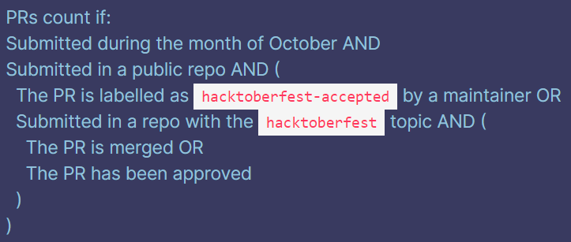
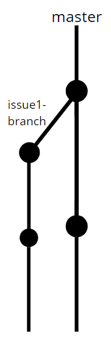
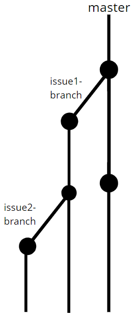
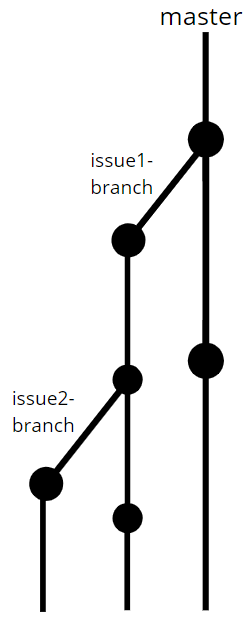

# Event flow

## Welcome and introduction

### CoC

https://do.co/hacktoberconduct

### Why is the event being conducted?

-   I got into Open Source through Hacktobesfest 2019. Want to pass on.

### What am I going to be talking about?

-   What is Open Source?
-   Why should you care about it and why Open Source something?
-   What is the spirit of Open Source?
-   Hacktoberfest
    -   What is it?
    -   Why is it held?
    -   What is it NOT about?
    -   What are the rules for Hacktoberfest 2020?
-   What types of PRs should you open?
-   Owner's/Maintainer's perspective.
-   Git and GitHub basics.
-   Pull requests
    -   How do you open a PR?
    -   Why is it a bad practice to open PRs from the master branch?
    -   How do you tackle the the two related issues problem and then add to just one of them?

## Open Source and Hacktoberfest

### What is Open Source?

### Why Open Source something?

-   People make it better ([Calculator PR](https://github.com/HarshKapadia2/calculator/issues/1))
-   You get to learn
-   To share your work
-   Setting a standard and increasing adoption

### What is the spirit of Open Source?

_"We rise by lifting others." -Robert Ingersoll_

-   A collective effort to improve something while being inclusive, kind and friendly.
-   There is no place for your ego.
-   People WANT you to contribute and won't give up on you too easily.

### What is Hacktoberfest?

It is an annual month long event held in October to promote Open Source in which people have to make four worthwhile PRs to earn prizes.

Official site: https://hacktoberfest.digitalocean.com

### Why is it held?

It helps promote Open Source by getting people interested, excited and passionate about it.

### What is Hacktoberfest NOT about?

It is not about the T-shirt. Spam PRs for the T-shirt and promotional spam on https://dev.to are not the way to go.

### What are the Hacktoberfest 2020 rules?

[Rules](https://hacktoberfest.digitalocean.com/hacktoberfest-update)

### What types of PRs should you open?

For Hacktoberfest

-   Target issues labelled `hacktoberfest`, `good-first-issue`, `first-timers-only`.
-   Don't open random PRs.
-   If you find a bug, raise an issue and then ask whether you can resolve the bug.

In general

-   Target issues labelled `good-first-issue`, `first-timers-only` at first, especially for the bigger repos and then move on to the more serious ones.
-   If you find a bug or want to improve something in a project, raise an issue or go to their forum and then ask whether you can resolve the bug or make the improvement. ([Example](https://github.com/processing/processing/pull/6048))
-   Documentation and typo correction contributions count as well!

### Owner's/Maintainer's perspective

-   CONTRIBUTING.md ([git_basics CONTRIBUTING.md example](https://github.com/HarshKapadia2/git_basics/blob/master/CONTRIBUTING.md))
-   One issue = One PR
-   Small and atomic PRs. ([Complication with big PRs](https://github.com/HarshKapadia2/one-or-two/pull/15))
-   New PRs for extra changes.

## Workshop (How to contribute to Open Source?)

### Git and GitHub basics

-   Explain [diagram 1](https://harshkapadia2.github.io/git_basics/#_git_pull) and [diagram 2](https://harshkapadia2.github.io/git_basics/#_git_add) in short. (Demo as part of PR sub-section)
-   Plug the [git_basics crash course](https://www.youtube.com/watch?v=HF12-91iazM).

### How do you open a PR?

-   Use repo [test2](https://github.com/saikiranjakkan/test2).
-   Don't forget to make a new branch for the PR.

### Why is it a bad practice to open PRs from the master branch?

-   Use repo [test3](https://github.com/saikiranjakkan/test3).
-   Make PR from the master branch and then make another commit to master and push it to the forked remote. Show the new commit reflected in the original PR.
-   Two problems
    -   Commits automatically reflect in PR.
    -   Syncing with original repo's master is not possible (fast-forward concept)

### How do you tackle the the two related issues problem and then add to just one of them?

-   Use repo [test1](https://github.com/saikiranjakkan/test1).
-   Issue 1 is a normal PR.
-   For the related issue (issue 2), make a branch off the issue 1 branch.

-   Show new addition to issue 1 and how that addition that is not reflected in the PR of issue 2 doesn't matter (as the merging is going to be in the order PR 1 and then PR 2).

-   [Example](https://github.com/HarshKapadia2/git_basics/issues/28)

## Open discussion and networking

-   Feedback form
